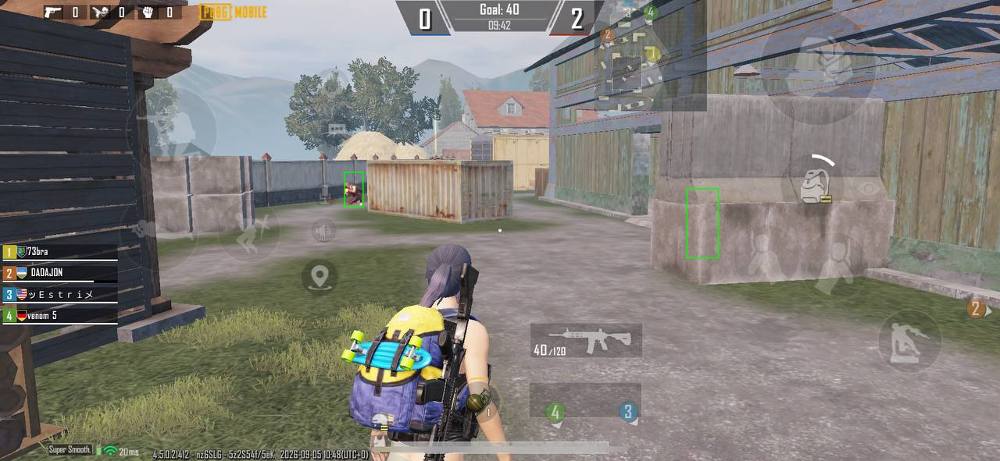

# iOSEsp

PUBG Mobile iOS client-server undetected ESP using kfd kernel exploit.

## Read [this](https://z3bra.cat/posts/ios-kernel-cheat/) before continuing

If you are too lazy to read the full writeup, below is a minimal description of how it works. 

## How It Works

The project uses a client-server architecture and is split into two parts: backend and frontend. 

The backend reads game information using the kfd kernel exploit and broadcasts it over the network to the frontend.

The frontend is a jailbreak overlay tweak that hooks into SprintBoard (iOS native render component) and draws the received data on screen. 

## Requirements 

- iOS 15 or 16
- Dopamine 2 (normal or roothide)

## Compilation 

If you don't want to compile it yourself, check the releases tab for pre-compiled binaries. If they exist, download them and skip straight to [Installation](#installation). 

The compilation process is designed for Linux. 
Theos, the compilation framework used here, is cross-platform, so it may compile on other operating systems. In that case, you will need to adjust the build configuration yourself. Honestly, if you don't have Linux, it may be easier to install Linux in a virtual machine and follow the instructions below.

Clone the project:

`git clone https://github.com/3a1/iOSEsp/`

Next, install the Theos framework. I left you a beautiful little `install_theos.sh` script for that purpose. During installation, you can skip Swift compilation support. 

Once Theos is installed, use the `build.sh` script in either the backend or frontend directory to compile.

The only exception, if you are using roohide Dopamine, use build_roothide.sh for the frontend instead. 

I have tried to make the compilation process as easy as possible. If you run into any problems, contact details are in the [Contact](#contact) section. 

## Installation

Make sure your device meets the requirements.

At this point, you should have the backend binary and the frontend tweak package.

First, install the jailbreak tweak using any package manager you have.
In my case, it's Sileo, so I just open the `.deb` package with the Sileo app. 
Remember to restart SpringBoard so the tweak hooks into the process.

Once the tweak is installed, you can copy and start the executable.
I usually use SSH to send and execute the backend from my PC, but you can also copy and run it directly from your device using Filza and a terminal app like NewTerm. 

You need to copy the backend binary into `{jailbreak_dir}/usr/bin/`. This directory is in the system PATH, so once copied, you can run the binary from anywhere in your terminal.

## Usage

The frontend is designed to run without manual intervention, the backend not fully. My typical workflow is simple, start the game, then launch the backend. When I close the game, I terminate the backend.

You can try the "start once and forget" approach, but it may accosionally deadlock on an old game process and require a manual restart.

Also will be worth mention about the settings. You can find them in the settings directory inside the `settings.h` file. I have added there some values or toggles for common settings that you might find useful to change. 

## Gameplay

You can check the TDM gameplay [here](https://www.youtube.com/watch?v=oUWc7tmIDGs) and small Ultimate Royale clip [here](https://youtu.be/AeAt1pqHPvc).

## Game Update

Every major game update changes the game offsets. I will try to keep the project updated for a while, but you may need to update the offsets yourself.

For this purpose, I created an `offsets.h` file in the backend directory. It contains offset definitions in the format `{ClassName}_{FieldName}`. You shouldn't have any trouble updating it using a game UE4 classes dump.

The same file also contains a define for the UWorld class pointer, commonly called `GWorld`. While game offsets are universal across devices running the same architecture (e.g. iOS arm64 and Android arm64 are identical) the UWorld pointer is not, it's game version based. I usually obtain that offset by locating its decryption routine in the game memory dump.

## Constribution

Whether you want to update the game offsets for a newer game version or make code changes, feel free to submit a commit. I will be glad to review it, and if it's useful, I will merge it.

## Contact

If you found this project helpful or want to see more of my work, follow my Telegram channel [here](https://t.me/zerologon).

If you run into any trouble or have any questions, you can find my up-to-date Telegram DM in the pinned message in the channel.

## Credits

- [Dopamine](https://github.com/opa334/dopamine) - Dopamine jailbreak
- [Dopamine-roothide](https://github.com/roothide/Dopamine2-roothide) - Dopamine roothide jailbreak
- [kfd](https://github.com/felix-pb/kfd) - Kernel exploit 
